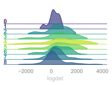

# MLMC: Machine Learning Monte Carlo
Sam Foreman
2023-12-15

# 

<!-- ::: {style="text-shadow: 0px 0px 10px RGBA(0, 0, 0, 0.45); background-color: rgba(22,22,22,0.33); border-radius: 10px; text-align:center; box-shadow:RGBA(0, 0, 0, 0.25) 0px 5px 15px; padding-top: 0.25em; padding-bottom: 0.25em;"} -->

MLMC:
Machine Learning Monte Carlo  
for
Lattice Gauge Theory  
    
 Sam Foreman  
Xiao-Yong Jin, James C.
Osborn  
[
`saforem2/`](https://github.com/saforem2/)`{`[`lattice23`](https://github.com/saforem2/lattice23),
[`l2hmc-qcd`](https://github.com/saforem2/l2hmc-qcd)`}`

2023-07-31 @
[Lattice
2023](https://indico.fnal.gov/event/57249/contributions/271305/)

# Overview

1.  [Background:
    `{MCMC,HMC}`](#markov-chain-monte-carlo-mcmc-centeredslide)
    - [Leapfrog Integrator](#leapfrog-integrator-hmc-centeredslide)
    - [Issues with HMC](#sec-issues-with-hmc)
    - [Can we do better?](#sec-can-we-do-better)
2.  [L2HMC: Generalizing MD](#sec-l2hmc)
    - [4D $SU(3)$ Model](#sec-su3)
    - [Results](#sec-results)
3.  [References](#sec-references)
4.  [Extras](#sec-extras)

# Markov Chain Monte Carlo (MCMC)

> **Goal**
>
> Generate **independent** samples $\{x_{i}\}$, such that[^1]
> $$\{x_{i}\} \sim p(x) \propto e^{-S(x)}$$ where $S(x)$ is the *action*
> (or potential energy)

- Want to calculate observables $\mathcal{O}$:  
  $\left\langle \mathcal{O}\right\rangle \propto \int \left[\mathcal{D}x\right]\hspace{4pt} {\mathcal{O}(x)\, p(x)}$

If these were independent, we could
approximate:
$\left\langle\mathcal{O}\right\rangle \simeq \frac{1}{N}\sum^{N}_{n=1}\mathcal{O}(x_{n})$  
$$\sigma_{\mathcal{O}}^{2} = \frac{1}{N}\mathrm{Var}{\left[\mathcal{O} (x)
  \right]}\Longrightarrow \sigma_{\mathcal{O}} \propto \frac{1}{\sqrt{N}}$$

[ `saforem2/lattice23`](https://saforem2.github.io/lattice23)

# Markov Chain Monte Carlo (MCMC)

> **Goal**
>
> Generate **independent** samples $\{x_{i}\}$, such that[^2]
> $$\{x_{i}\} \sim p(x) \propto e^{-S(x)}$$ where $S(x)$ is the *action*
> (or potential energy)

- Want to calculate observables $\mathcal{O}$:  
  $\left\langle \mathcal{O}\right\rangle \propto \int \left[\mathcal{D}x\right]\hspace{4pt} {\mathcal{O}(x)\, p(x)}$

Instead, nearby configs are correlated,
and we incur a factor of
$\textcolor{#FF5252}{\tau^{\mathcal{O}}_{\mathrm{int}}}$:
$$\sigma_{\mathcal{O}}^{2} =
  \frac{\textcolor{#FF5252}{\tau^{\mathcal{O}}_{\mathrm{int}}}}{N}\mathrm{Var}{\left[\mathcal{O}
  (x) \right]}$$

[ `saforem2/lattice23`](https://github.com/saforem2/lattice23)

# Hamiltonian Monte Carlo (HMC)

- Want to (sequentially) construct a chain of states:
  $$x_{0} \rightarrow x_{1} \rightarrow x_{i} \rightarrow \cdots \rightarrow x_{N}\hspace{10pt}$$

  such that, as $N \rightarrow \infty$:
  $$\left\{x_{i}, x_{i+1}, x_{i+2}, \cdots, x_{N} \right\} \xrightarrow[]{N\rightarrow\infty} p(x)
  \propto e^{-S(x)}$$

> **Trick**
>
> - Introduce fictitious momentum
>   $v \sim \mathcal{N}(0, \mathbb{1})$
>   - Normally distributed **independent** of $x$, i.e. $$\begin{align*}
>     p(x, v) &\textcolor{#02b875}{=} p(x)\,p(v) \propto e^{-S{(x)}} e^{-\frac{1}{2} v^{T}v}
>     = e^{-\left[S(x) + \frac{1}{2} v^{T}{v}\right]}
>     \textcolor{#02b875}{=} e^{-H(x, v)}
>     \end{align*}$$

## Hamiltonian Monte Carlo (HMC)

- **Idea**: Evolve the
  $(\dot{x}, \dot{v})$ system to get new states $\{x_{i}\}$❗

- Write the **joint distribution** $p(x, v)$: $$
  p(x, v) \propto e^{-S[x]} e^{-\frac{1}{2}v^{T} v} = e^{-H(x, v)}
  $$

> **Hamiltonian Dynamics**
>
> $H = S[x] + \frac{1}{2} v^{T} v \Longrightarrow$
> $$\dot{x} = +\partial_{v} H,
> \,\,\dot{v} = -\partial_{x} H$$

Figure 1: Overview of HMC algorithm

## Leapfrog Integrator (HMC)

> **Hamiltonian Dynamics**
>
> $\left(\dot{x}, \dot{v}\right) = \left(\partial_{v} H, -\partial_{x} H\right)$

> **Leapfrog Step**
>
> `input` $\,\left(x, v\right) \rightarrow \left(x', v'\right)\,$
> `output`
>
> $$\begin{align*}
> \tilde{v} &:= \textcolor{#F06292}{\Gamma}(x, v)\hspace{2.2pt} = v - \frac{\varepsilon}{2} \partial_{x} S(x) \\
> x' &:= \textcolor{#FD971F}{\Lambda}(x, \tilde{v}) \, =  x + \varepsilon \, \tilde{v} \\
> v' &:= \textcolor{#F06292}{\Gamma}(x', \tilde{v}) = \tilde{v} - \frac{\varepsilon}{2} \partial_{x} S(x')
> \end{align*}$$

> **Warning!**
>
> Resample
> $v_{0} \sim \mathcal{N}(0, \mathbb{1})$  
> at the
> beginning of each trajectory

**Note**: $\partial_{x} S(x)$ is the
*force*

## HMC Update

- We build a trajectory of $N_{\mathrm{LF}}$ **leapfrog steps**[^3]
  $$\begin{equation*}
  (x_{0}, v_{0})%
  \rightarrow (x_{1}, v_{1})\rightarrow \cdots%
  \rightarrow (x', v')
  \end{equation*}$$

- And propose $x'$ as the next state in our chain
  <!-- - which is _accepted_ (or rejected) via Metroplis-Hastings[^accept] -->
  <!-- - $x'$ is proposed with probability $A(x'|x)$[^accept] -->
  <!-- - Use $x'$ as our proposal in the Metropolis-Hastings accept / reject, $A(x'|x)$ -->

$$\begin{align*}
  \textcolor{#F06292}{\Gamma}: (x, v) \textcolor{#F06292}{\rightarrow} v' &:= v - \frac{\varepsilon}{2} \partial_{x} S(x) \\
  \textcolor{#FD971F}{\Lambda}: (x, v) \textcolor{#FD971F}{\rightarrow} x' &:= x + \varepsilon v
\end{align*}$$

- We then accept / reject $x'$ using Metropolis-Hastings criteria,  
  $A(x'|x) = \min\left\{1, \frac{p(x')}{p(x)}\left|\frac{\partial x'}{\partial x}\right|\right\}$

## HMC Demo

<iframe data-src="https://chi-feng.github.io/mcmc-demo/app.html" width="90%" height="500" title="l2hmc-qcd">
</iframe>

Figure 2: HMC Demo

# Issues with HMC

- What do we want in a good sampler?
  - **Fast mixing** (small autocorrelations)
  - **Fast burn-in** (quick convergence)
- Problems with HMC:
  - Energy levels selected randomly $\rightarrow$ **slow mixing**
  - Cannot easily traverse low-density zones $\rightarrow$ **slow
    convergence**

<table>
<colgroup>
<col style="width: 50%" />
<col style="width: 50%" />
</colgroup>
<tbody>
<tr class="odd">
<td style="text-align: center;">

</td>
<td style="text-align: center;">

</td>
</tr>
</tbody>
</table>

Figure 3: HMC Samples generated with varying step sizes $\varepsilon$

# Topological Freezing

**Topological Charge**:
$$Q = \frac{1}{2\pi}\sum_{P}\left\lfloor x_{P}\right\rfloor  \in \mathbb{Z}$$

**note:**
$\left\lfloor x_{P} \right\rfloor = x_{P} - 2\pi \left\lfloor\frac{x_{P} + \pi}{2\pi}\right\rfloor$

> **Critical Slowing Down**
>
> - $Q$ gets stuck!
>   - as $\beta\longrightarrow \infty$:
>     - $Q \longrightarrow \text{const.}$
>     - $\delta Q = \left(Q^{\ast} - Q\right) \rightarrow 0 \textcolor{#FF5252}{\Longrightarrow}$
>   - \# configs required to estimate errors  
>     **grows exponentially**:
>     $\tau_{\mathrm{int}}^{Q} \longrightarrow \infty$

<!-- Illustration of critical slowing down at increasing $\beta$. Note at $\beta = 7$, $Q$ remains stuck for the entire run. -->

# Can we do better?

- Introduce two (**invertible NNs**) `vNet` and `xNet`[^4]:
  - `vNet:`
    $(x, F) \longrightarrow \left(s_{v},\, t_{v},\, q_{v}\right)$  
  - `xNet:`
    $(x, v) \longrightarrow \left(s_{x},\, t_{x},\, q_{x}\right)$
    <!-- - [[$x$]{.purple-text}-update]{style="border-bottom: 2px solid #AE81FF;"}:   -->
    <!-- - [[$v$]{.green-text}-update]{style="border-bottom: 2px solid #09B875"}:   -->

 

<!-- $\left(s_{k}, t_{k}, q_{k}\right)$, $k \in \{x, v\}$ in the -->

- Use these $(s, t, q)$ in the *generalized* MD update:
  - $\Gamma_{\theta}^{\pm}$
    $: ({x}, \textcolor{#07B875}{v}) \xrightarrow[]{\textcolor{#F06292}{s_{v}, t_{v}, q_{v}}} (x, \textcolor{#07B875}{v'})$
  - $\Lambda_{\theta}^{\pm}$
    $: (\textcolor{#AE81FF}{x}, v) \xrightarrow[]{\textcolor{#FD971F}{s_{x}, t_{x}, q_{x}}} (\textcolor{#AE81FF}{x'}, v)$
    <!-- - [[$x$]{.purple-text}-update]{style="border-bottom: 2px solid #AE81FF;"}:   -->
    <!-- - [[$v$]{.green-text}-update]{style="border-bottom: 2px solid #09B875"}:   -->

<!-- {style="width:75%; text-align:right!important; padding-left: 3em;"} -->

Figure 4: Generalized MD update where
$\Lambda_{\theta}^{\pm}$,
$\Gamma_{\theta}^{\pm}$ are **invertible
NNs**

# L2HMC: Generalizing the MD Update

> **L2HMC Update**
>
> - Introduce $d \sim \mathcal{U}(\pm)$ to determine the direction[^5]
>   of our update
>
> 1.  $\textcolor{#07B875}{v'} =$
>     $\Gamma^{\pm}$$({x}, \textcolor{#07B875}{v})$
>     $\hspace{46pt}$
>     update $v$
>
> 2.  $\textcolor{#AE81FF}{x'} =$
>     $x_{B}$$\,+\,$$\Lambda^{\pm}$$($$x_{A}$$, {v'})$
>     $\hspace{10pt}$
>     update first **half**: $x_{A}$
>
> 3.  $\textcolor{#AE81FF}{x''} =$
>     $x'_{A}$$\,+\,$$\Lambda^{\pm}$$($$x'_{B}$$, {v'})$
>     $\hspace{8pt}$
>     update other half: $x_{B}$
>
> 4.  $\textcolor{#07B875}{v''} =$
>     $\Gamma^{\pm}$$({x''}, \textcolor{#07B875}{v'})$
>     $\hspace{36pt}$
>     update $v$

  

<!-- - [**Note**: [$\Gamma^{\pm}$]{.pink-text} and [$\Lambda^{\pm}$]{.orange-text} are invertible NNs]{style="font-size:0.8em;"} -->
<!-- [^updates]: [Here [$\Gamma^{\pm}$]{.pink-text} and [$\Lambda^{\pm}$]{.orange-text} are invertible NNs]{style="font-size:0.8em;"} -->

<!-- {style="width:75%; text-align:right!important; padding-left: 3em;"} -->

Figure 5: Generalized MD update with
$\Lambda_{\theta}^{\pm}$,
$\Gamma_{\theta}^{\pm}$ **invertible
NNs**

## L2HMC: Leapfrog Layer

## L2HMC Update

> **Algorithm**
>
> 1.  `input`: $x$
>
>     - Resample:
>       $\textcolor{#07B875}{v} \sim \mathcal{N}(0, \mathbb{1})$;
>       $\,\,{d\sim\mathcal{U}(\pm)}$
>     - Construct initial state:
>       $\textcolor{#939393}{\xi} =(\textcolor{#AE81FF}{x}, \textcolor{#07B875}{v}, {\pm})$
>
> 2.  `forward`: Generate proposal
>     $\xi'$ by passing initial
>     $\xi$ through $N_{\mathrm{LF}}$ leapfrog layers  
>     $$\textcolor{#939393} \xi \hspace{1pt}\xrightarrow[]{\tiny{\mathrm{LF} \text{ layer}}}\xi_{1} \longrightarrow\cdots \longrightarrow \xi_{N_{\mathrm{LF}}} = \textcolor{#f8f8f8}{\xi'} := (\textcolor{#AE81FF}{x''}, \textcolor{#07B875}{v''})$$
>
>     - Accept / Reject: $$\begin{equation*}
>       A({\textcolor{#f8f8f8}{\xi'}}|{\textcolor{#939393}{\xi}})=
>       \mathrm{min}\left\{1,
>       \frac{\pi(\textcolor{#f8f8f8}{\xi'})}{\pi(\textcolor{#939393}{\xi})} \left| \mathcal{J}\left(\textcolor{#f8f8f8}{\xi'},\textcolor{#939393}{\xi}\right)\right| \right\}
>       \end{equation*}$$
>
> 3.  `backward` (if training):
>
>     - Evaluate the **loss function**[^6]
>       $\mathcal{L}\gets \mathcal{L}_{\theta}(\textcolor{#f8f8f8}{\xi'}, \textcolor{#939393}{\xi})$
>       and backprop
>
> 4.  `return`: $\textcolor{#AE81FF}{x}_{i+1}$  
>     Evaluate MH criteria $(1)$ and return accepted config,
>     $$\textcolor{#AE81FF}{{x}_{i+1}}\gets
>       \begin{cases}
>       \textcolor{#f8f8f8}{\textcolor{#AE81FF}{x''}} \small{\text{ w/ prob }} A(\textcolor{#f8f8f8}{\xi''}|\textcolor{#939393}{\xi}) \hspace{26pt} ✅ \\
>       \textcolor{#939393}{\textcolor{#AE81FF}{x}} \hspace{5pt}\small{\text{ w/ prob }} 1 - A(\textcolor{#f8f8f8}{\xi''}|{\textcolor{#939393}{\xi}}) \hspace{10pt} 🚫
>       \end{cases}$$

<!-- {style="width:75%; text-align:right!important; padding-left: 3em;"} -->

Figure 6: **Leapfrog Layer** used in generalized MD update

# 4D $SU(3)$ Model

> **Link Variables**
>
> - Write link variables $U_{\mu}(x) \in SU(3)$:
>
>   $$ \begin{align*} 
>   U_{\mu}(x) &= \mathrm{exp}\left[{i\, \textcolor{#AE81FF}{\omega^{k}_{\mu}(x)} \lambda^{k}}\right]\\
>   &= e^{i \textcolor{#AE81FF}{Q}},\quad \text{with} \quad \textcolor{#AE81FF}{Q} \in \mathfrak{su}(3)
>   \end{align*}$$
>
>   where
>   $\omega^{k}_{\mu}(x)$
>   $\in \mathbb{R}$, and $\lambda^{k}$ are the generators of
>   $SU(3)$

> **Conjugate Momenta**
>
> - Introduce
>   $P_{\mu}(x) = P^{k}_{\mu}(x) \lambda^{k}$
>   conjugate to $\omega^{k}_{\mu}(x)$

> **Wilson Action**
>
> $$ S_{G} = -\frac{\beta}{6} \sum
> \mathrm{Tr}\left[U_{\mu\nu}(x)
> + U^{\dagger}_{\mu\nu}(x)\right] $$
>
> where
> $U_{\mu\nu}(x) = U_{\mu}(x) U_{\nu}(x+\hat{\mu}) U^{\dagger}_{\mu}(x+\hat{\nu}) U^{\dagger}_{\nu}(x)$

Figure 7: Illustration of the lattice

## HMC: 4D $SU(3)$

Hamiltonian: $H[P, U] = \frac{1}{2} P^{2} + S[U] \Longrightarrow$

> **None**
>
> - $U$ update:
>      style="font-size:1.5em;">$\frac{d\omega^{k}}{dt} = \frac{\partial H}{\partial P^{k}}$
>   $$\frac{d\omega^{k}}{dt}\lambda^{k} = P^{k}\lambda^{k} \Longrightarrow \frac{dQ}{dt} = P$$
>   $$\begin{align*}
>   Q(\textcolor{#FFEE58}{\varepsilon}) &= Q(0) + \textcolor{#FFEE58}{\varepsilon} P(0)\Longrightarrow\\
>   -i\, \log U(\textcolor{#FFEE58}{\varepsilon}) &= -i\, \log U(0) + \textcolor{#FFEE58}{\varepsilon} P(0) \\
>   U(\textcolor{#FFEE58}{\varepsilon}) &= e^{i\,\textcolor{#FFEE58}{\varepsilon} P(0)} U(0)\Longrightarrow \\
>   &\hspace{1pt}\\
>   \textcolor{#FD971F}{\Lambda}:\,\, U \longrightarrow U' &\coloneqq e^{i\varepsilon P'} U
>   \end{align*}$$

$\textcolor{#FFEE58}{\varepsilon}$ is the step
size

> **None**
>
> - $P$ update:
>      style="font-size:1.5em;">$\frac{dP^{k}}{dt} = - \frac{\partial H}{\partial \omega^{k}}$
>   $$\frac{dP^{k}}{dt} = - \frac{\partial H}{\partial \omega^{k}}
>   = -\frac{\partial H}{\partial Q} = -\frac{dS}{dQ}\Longrightarrow$$
>   $$\begin{align*}
>   P(\textcolor{#FFEE58}{\varepsilon}) &= P(0) - \textcolor{#FFEE58}{\varepsilon} \left.\frac{dS}{dQ}\right|_{t=0} \\
>   &= P(0) - \textcolor{#FFEE58}{\varepsilon} \,\textcolor{#E599F7}{F[U]} \\
>   &\hspace{1pt}\\
>   \textcolor{#F06292}{\Gamma}:\,\, P \longrightarrow P' &\coloneqq P - \frac{\varepsilon}{2} F[U]
>   \end{align*}$$

$\textcolor{#E599F7}{F[U]}$ is the force
term

## HMC: 4D $SU(3)$

- Momentum
  Update:
  $$\textcolor{#F06292}{\Gamma}: P \longrightarrow P' := P - \frac{\varepsilon}{2} F[U]$$

- Link Update:
  $$\textcolor{#FD971F}{\Lambda}: U \longrightarrow U' := e^{i\varepsilon P'} U\quad\quad$$

- We maintain a batch of `Nb` lattices, all updated in parallel

  - $U$`.dtype = complex128` <!-- - `shape`$\left(U\right)$:   -->
  - $U$`.shape`  
    `= [Nb, 4, Nt, Nx, Ny, Nz, 3, 3]`

<!-- # 4D $SU(3)$ Model {.centeredslide} -->
<!---->
<!-- :::: {.columns} -->
<!---->
<!-- ::: {.column width="45%" style="font-size:0.9em;"} -->
<!---->
<!-- - link variables:  -->
<!--     - $U_{\mu}(x) \in SU(3)$, -->
<!-- - \+ conjugate momenta: -->
<!--     - $P_{\mu}(x) \in \mathfrak{su}(3)$ -->
<!-- - We maintain a batch of `Nb` lattices, all updated in parallel -->
<!--     - `lattice.shape`: -->
<!--         - [`[4, Nt, Nx, Ny, Nz, 3, 3]`]{style="font-size: 0.9em;"} -->
<!--     - `batch.shape`: -->
<!--         - [`[Nb, *lattice.shape]`]{style="font-size: 0.9em;"} -->
<!-- ::: -->
<!---->
<!-- ::: {.column width="45%"} -->
<!---->
<!--  -->
<!---->
<!-- ::: -->
<!---->
<!-- :::: -->

# Networks 4D $SU(3)$

  

  

$U$-Network:

`UNet:`
$(U, P) \longrightarrow \left(s_{U},\, t_{U},\, q_{U}\right)$

  

$P$-Network:

`PNet:`
$(U, P) \longrightarrow \left(s_{P},\, t_{P},\, q_{P}\right)$

# Networks 4D $SU(3)$

  

  

$U$-Network:

`UNet:`
$(U, P) \longrightarrow \left(s_{U},\, t_{U},\, q_{U}\right)$

  

$P$-Network:

`PNet:`
$(U, P) \longrightarrow \left(s_{P},\, t_{P},\, q_{P}\right)$

$\uparrow$  
let’s look
at this

## $P$-`Network` (pt. 1)

- `input`[^7]:
  $\hspace{7pt}\left(U, F\right) \coloneqq (e^{i Q}, F)$
  $$\begin{align*}
  h_{0} &= \sigma\left( w_{Q} Q + w_{F} F + b \right) \\
  h_{1} &= \sigma\left( w_{1} h_{0} + b_{1} \right) \\
  &\vdots \\
  h_{n} &= \sigma\left(w_{n-1} h_{n-2} + b_{n}\right) \\
  \textcolor{#FF5252}{z} & \coloneqq \sigma\left(w_{n} h_{n-1} + b_{n}\right) \longrightarrow \\
  \end{align*}$$

- `output`[^8]:
  $\hspace{7pt} (s_{P}, t_{P}, q_{P})$

  - $s_{P} = \lambda_{s} \tanh(w_s \textcolor{#FF5252}{z} + b_s)$
  - $t_{P} = w_{t} \textcolor{#FF5252}{z} + b_{t}$
  - $q_{P} = \lambda_{q} \tanh(w_{q} \textcolor{#FF5252}{z} + b_{q})$

## $P$-`Network` (pt. 2)

<!-- - `output`[^lambda]: $(s_{P}, t_{P}, q_{P})$ [$\hspace{10pt}\longleftarrow$ outputs from NN]{.dim-text} -->
<!--   $$s_{P} = \lambda_{s} \tanh\left(w_{s}\, z + b_{s}\right), \quad -->
<!--   t_{P} = w_{t} z + b_{t}, \quad -->
<!--   q_{P} = \lambda_{q}\tanh\left(w_{q} z + b_{q}\right)$$ -->

- Use $(s_{P}, t_{P}, q_{P})$ to update
  $\Gamma^{\pm}: (U, P) \rightarrow \left(U, P_{\pm}\right)$[^9]:

  - forward
    $(d = \textcolor{#FF5252}{+})$:
    $$\Gamma^{\textcolor{#FF5252}{+}}(U, P) \coloneqq P_{\textcolor{#FF5252}{+}} = P \cdot e^{\frac{\varepsilon}{2} s_{P}} - \frac{\varepsilon}{2}\left[ F \cdot e^{\varepsilon q_{P}} + t_{P} \right]$$

  - backward
    $(d = \textcolor{#1A8FFF}{-})$:
    $$\Gamma^{\textcolor{#1A8FFF}{-}}(U, P) \coloneqq P_{\textcolor{#1A8FFF}{-}} = e^{-\frac{\varepsilon}{2} s_{P}} \left\{P + \frac{\varepsilon}{2}\left[ F \cdot e^{\varepsilon q_{P}} + t_{P} \right]\right\}$$

# Results: 2D $U(1)$

> **Improvement**
>
> We can measure the performance by comparing $\tau_{\mathrm{int}}$ for
> the **trained model** vs.
> **HMC**.
>
> **Note**: lower is better

## Interpretation

Deviation in $x_{P}$

Topological charge
mixing

Artificial influx
of energy

Figure 8: Illustration of how different observables evolve over a single
L2HMC trajectory.

## Interpretation

<table>
<colgroup>
<col style="width: 50%" />
<col style="width: 50%" />
</colgroup>
<tbody>
<tr class="odd">
<td style="text-align: center;">

</td>
<td style="text-align: center;">

</td>
</tr>
</tbody>
</table>

Figure 9: The trained model artifically increases the energy towards the
middle of the trajectory, allowing the sampler to tunnel between
isolated sectors.

# 4D $SU(3)$ Results

<table style="width:100%;">
<colgroup>
<col style="width: 33%" />
<col style="width: 33%" />
<col style="width: 33%" />
</colgroup>
<tbody>
<tr class="odd">
<td style="text-align: center;">

</td>
<td style="text-align: center;">

</td>
<td style="text-align: center;">

</td>
</tr>
</tbody>
</table>

Figure 10: $\log|\mathcal{J}|$ vs. $N_{\mathrm{LF}}$ during training

## 4D $SU(3)$ Results: $\delta U_{\mu\nu}$

Figure 11: The difference in the average plaquette
$\left|\delta U_{\mu\nu}\right|^{2}$ between the trained model and HMC

## 4D $SU(3)$ Results: $\delta U_{\mu\nu}$

Figure 12: The difference in the average plaquette
$\left|\delta U_{\mu\nu}\right|^{2}$ between the trained model and HMC

# Next Steps

- Further code development

  -  [`saforem2/l2hmc-qcd`](https://github.com/saforem2/l2hmc-qcd)

- Continue to use / test different network architectures

  - Gauge equivariant NNs for $U_{\mu}(x)$ update

- Continue to test different loss functions for training

- Scaling:

  - Lattice volume
  - Network size
  - Batch size
  - \# of GPUs

## Thank you!

  

<table>
<colgroup>
<col style="width: 25%" />
<col style="width: 25%" />
<col style="width: 25%" />
<col style="width: 25%" />
</colgroup>
<tbody>
<tr class="odd">
<td style="text-align: center;">

<a href="https://samforeman.me">
<code>samforeman.me</code></a>

</td>
<td style="text-align: center;">

<a href="https://github.com/saforem2">
<code>saforem2</code></a>

</td>
<td style="text-align: center;">

<a
href="https://www.twitter.com/saforem2">
<code>@saforem2</code></a>

</td>
<td style="text-align: center;">

<a href="mailto:///foremans@anl.gov">
<code>foremans@anl.gov</code></a>

</td>
</tr>
</tbody>
</table>

> **Acknowledgements**
>
> This research used resources of the Argonne Leadership Computing
> Facility,  
> which is a DOE Office of Science User Facility supported under
> Contract DE-AC02-06CH11357.

## 

## Acknowledgements

- **Links**:
  - [ Link to github](https://github.com/saforem2/l2hmc-qcd)
  - [ reach out!](mailto:foremans@anl.gov)
- **References**:
  - [Link to slides](https://saforem2.github.io/lattice23/)
    - [ link to github with
      slides](https://github.com/saforem2/lattice23)
  -  (Foreman et al. 2022; Foreman, Jin, and Osborn 2022, 2021)
  -  (Boyda et al. 2022; Shanahan et al. 2022)

- Huge thank you to:
  - Yannick Meurice
  - Norman Christ
  - Akio Tomiya
  - Nobuyuki Matsumoto
  - Richard Brower
  - Luchang Jin
  - Chulwoo Jung
  - Peter Boyle
  - Taku Izubuchi
  - Denis Boyda
  - Dan Hackett
  - ECP-CSD group
  - **ALCF Staff + Datascience Group**

## 

### Links

- [ `saforem2/l2hmc-qcd`](https://github.com/saforem2/l2hmc-qcd)

- [📊 slides](https://saforem2.github.io/lattice23) (Github: [
  `saforem2/lattice23`](https://github.com/saforem2/lattice23))

### References

- [Title Slide Background (worms)
  animation](https://saforem2.github.io/grid-worms-animation/)
  - Github: [
    `saforem2/grid-worms-animation`](https://github.com/saforem2/grid-worms-animation)
- [Link to HMC demo](https://chi-feng.github.io/mcmc-demo/app.html)

## References

(I don’t know why this is broken 🤷🏻‍♂️ )

Boyda, Denis et al. 2022. “Applications of Machine
Learning to Lattice Quantum Field Theory.” In *Snowmass 2021*.
<https://arxiv.org/abs/2202.05838>.

Foreman, Sam, Taku Izubuchi, Luchang Jin, Xiao-Yong Jin, James C.
Osborn, and Akio Tomiya. 2022. “HMC with
Normalizing Flows.” *PoS* LATTICE2021: 073.
<https://doi.org/10.22323/1.396.0073>.

Foreman, Sam, Xiao-Yong Jin, and James C. Osborn. 2021. “Deep Learning
Hamiltonian Monte Carlo.” In *9th International
Conference on Learning Representations*.
<https://arxiv.org/abs/2105.03418>.

———. 2022. “LeapfrogLayers: A Trainable Framework
for Effective Topological Sampling.” *PoS* LATTICE2021 (May):
508. <https://doi.org/10.22323/1.396.0508>.

Shanahan, Phiala et al. 2022. “Snowmass 2021 Computational Frontier
CompF03 Topical Group Report: Machine Learning,” September.
<https://arxiv.org/abs/2209.07559>.

# Extras

## Integrated Autocorrelation Time

Figure 13: Plot of the integrated autocorrelation time for both the
trained model (colored) and HMC (greyscale).

## Comparison

<table>
<colgroup>
<col style="width: 50%" />
<col style="width: 50%" />
</colgroup>
<tbody>
<tr class="odd">
<td style="text-align: center;">

</td>
<td style="text-align: center;">

</td>
</tr>
</tbody>
</table>

Figure 14: Comparison of
$\langle \delta Q\rangle = \frac{1}{N}\sum_{i=k}^{N} \delta Q_{i}$ for
the trained model [Figure 14 (a)](#fig-eval) vs. HMC [Figure 14
(b)](#fig-hmc)

## Plaquette analysis: $x_{P}$

Deviation from
$V\rightarrow\infty$ limit, $x_{P}^{\ast}$

Average
$\langle x_{P}\rangle$, with $x_{P}^{\ast}$ (dotted-lines)

Figure 15: Plot showing how **average plaquette**,
$\left\langle x_{P}\right\rangle$ varies over a single trajectory for
models trained at different $\beta$, with varying trajectory lengths
$N_{\mathrm{LF}}$

## Loss Function

- Want to maximize the *expected* squared charge difference[^10]:
  $$\begin{equation*}
  \mathcal{L}_{\theta}\left(\xi^{\ast}, \xi\right) =
  {\mathbb{E}_{p(\xi)}}\big[-\textcolor{#FA5252}{{\delta Q}}^{2}
  \left(\xi^{\ast}, \xi \right)\cdot A(\xi^{\ast}|\xi)\big]
  \end{equation*}$$

- Where:

  - $\delta Q$ is the *tunneling rate*: $$\begin{equation*}
    \textcolor{#FA5252}{\delta Q}(\xi^{\ast},\xi)=\left|Q^{\ast} - Q\right|
    \end{equation*}$$

  - $A(\xi^{\ast}|\xi)$ is the probability[^11] of accepting the
    proposal $\xi^{\ast}$: $$\begin{equation*}
    A(\xi^{\ast}|\xi) = \mathrm{min}\left( 1,
    \frac{p(\xi^{\ast})}{p(\xi)}\left|\frac{\partial \xi^{\ast}}{\partial
    \xi^{T}}\right|\right)
    \end{equation*}$$

## Networks 2D $U(1)$

- Stack gauge links as `shape`$\left(U_{\mu}\right)$`=[Nb, 2, Nt, Nx]`
  $\in \mathbb{C}$

  $$ x_{\mu}(n) ≔ \left[\cos(x), \sin(x)\right]$$

  with `shape`$\left(x_{\mu}\right)$`= [Nb, 2, Nt, Nx, 2]`
  $\in \mathbb{R}$

- $x$-Network:

  - $\psi_{\theta}: (x, v) \longrightarrow \left(s_{x},\, t_{x},\, q_{x}\right)$
    <!-- - $\Lambda^{\pm}_{k}(x, v) \rightarrow \left[s^{k}_{x}, t^{k}_{x}, q^{k}_{x}\right]$ -->

- $v$-Network:

  - $\varphi_{\theta}: (x, v) \longrightarrow \left(s_{v},\, t_{v},\, q_{v}\right)$
    $\hspace{2pt}\longleftarrow$ lets look at
    this
    <!-- - $\Gamma_{k}^{\pm}(x, v) \rightarrow \left[s^{k}_{v}, t^{k}_{v}, q^{k}_{v}\right]$ -->

## $v$-Update[^12]

- forward
  $(d = \textcolor{#FF5252}{+})$:  
  <!-- $\Gamma^{\textcolor{#FF5252}{+}}: (x, v) \rightarrow v'$ -->

$$\Gamma^{\textcolor{#FF5252}{+}}: (x, v) \rightarrow v' \coloneqq v \cdot e^{\frac{\varepsilon}{2} s_{v}} - \frac{\varepsilon}{2}\left[ F \cdot e^{\varepsilon q_{v}} + t_{v} \right]$$

- backward
  $(d = \textcolor{#1A8FFF}{-})$:

$$\Gamma^{\textcolor{#1A8FFF}{-}}: (x, v) \rightarrow v' \coloneqq e^{-\frac{\varepsilon}{2} s_{v}} \left\{v + \frac{\varepsilon}{2}\left[ F \cdot e^{\varepsilon q_{v}} + t_{v} \right]\right\}$$

## $x$-Update

- forward
  $(d = \textcolor{#FF5252}{+})$:

$$\Lambda^{\textcolor{#FF5252}{+}}(x, v) = x \cdot e^{\frac{\varepsilon}{2} s_{x}} - \frac{\varepsilon}{2}\left[ v \cdot e^{\varepsilon q_{x}} + t_{x} \right]$$

- backward
  $(d = \textcolor{#1A8FFF}{-})$:

$$\Lambda^{\textcolor{#1A8FFF}{-}}(x, v) = e^{-\frac{\varepsilon}{2} s_{x}} \left\{x + \frac{\varepsilon}{2}\left[ v \cdot e^{\varepsilon q_{x}} + t_{x} \right]\right\}$$

## Lattice Gauge Theory (2D $U(1)$)

> **Link Variables**
>
> $$U_{\mu}(n) = e^{i x_{\mu}(n)}\in \mathbb{C},\quad \text{where}\quad$$
> $$x_{\mu}(n) \in [-\pi,\pi)$$

> **Wilson Action**
>
> $$S_{\beta}(x) = \beta\sum_{P} \cos \textcolor{#00CCFF}{x_{P}},$$
>
> $$\textcolor{#00CCFF}{x_{P}} = \left[x_{\mu}(n) + x_{\nu}(n+\hat{\mu})
> - x_{\mu}(n+\hat{\nu})-x_{\nu}(n)\right]$$

**Note**:
$\textcolor{#00CCFF}{x_{P}}$ is the product of links around $1\times 1$
square, called a “plaquette”

## 

<iframe data-src="https://nbviewer.org/github/saforem2/l2hmc-qcd/blob/SU3/src/l2hmc/notebooks/l2hmc-2dU1.ipynb" width="100%" height="650" title="l2hmc-qcd">
</iframe>

Figure 16: Jupyter Notebook

## Annealing Schedule

- Introduce an *annealing schedule* during the training phase:

  $$\left\{ \gamma_{t}  \right\}_{t=0}^{N} = \left\{\gamma_{0}, \gamma_{1},
  \ldots, \gamma_{N-1}, \gamma_{N} \right\}$$

  where $\gamma_{0} < \gamma_{1} < \cdots < \gamma_{N} \equiv 1$, and
  $\left|\gamma_{t+1} - \gamma_{t}\right| \ll 1$

- **Note**:

  - for $\left|\gamma_{t}\right| < 1$, this rescaling helps to reduce
    the height of the energy barriers $\Longrightarrow$
  - easier for our sampler to explore previously inaccessible regions of
    the phase space

## Networks 2D $U(1)$

- Stack gauge links as `shape`$\left(U_{\mu}\right)$`=[Nb, 2, Nt, Nx]`
  $\in \mathbb{C}$

  $$ x_{\mu}(n) ≔ \left[\cos(x), \sin(x)\right]$$

  with `shape`$\left(x_{\mu}\right)$`= [Nb, 2, Nt, Nx, 2]`
  $\in \mathbb{R}$

- $x$-Network:

  - $\psi_{\theta}: (x, v) \longrightarrow \left(s_{x},\, t_{x},\, q_{x}\right)$
    <!-- - $\Lambda^{\pm}_{k}(x, v) \rightarrow \left[s^{k}_{x}, t^{k}_{x}, q^{k}_{x}\right]$ -->

- $v$-Network:

  - $\varphi_{\theta}: (x, v) \longrightarrow \left(s_{v},\, t_{v},\, q_{v}\right)$
    <!-- - $\Gamma_{k}^{\pm}(x, v) \rightarrow \left[s^{k}_{v}, t^{k}_{v}, q^{k}_{v}\right]$ -->

## Toy Example: GMM $\in \mathbb{R}^{2}$

## Physical Quantities

- To estimate physical quantities, we:
  - Calculate physical observables at **increasing** spatial resolution
  - Perform extrapolation to continuum limit

Figure 17: Increasing the physical resolution ($a \rightarrow 0$) allows
us to make predictions about numerical values of physical quantities in
the continuum limit.

# Extra

[^1]: Here, $\sim$ means “is distributed according to”

[^2]: Here, $\sim$ means “is distributed according to”

[^3]: We **always** start by resampling the momentum,
    $v_{0} \sim \mathcal{N}(0, \mathbb{1})$

[^4]: [L2HMC:](https://github.com/saforem2/l2hmc-qcd) (Foreman, Jin, and
    Osborn 2021, 2022)

[^5]: Resample both $v\sim \mathcal{N}(0, 1)$, and
    $d \sim \mathcal{U}(\pm)$ at the beginning of each trajectory

[^6]: For simple $\mathbf{x} \in \mathbb{R}^{2}$ example,
    $\mathcal{L}_{\theta} = A(\xi^{\ast}|\xi)\cdot \left(\mathbf{x}^{\ast} - \mathbf{x}\right)^{2}$

[^7]: $\sigma(\cdot)$ denotes an activation function

[^8]: $\lambda_{s},\, \lambda_{q} \in \mathbb{R}$ are trainable
    parameters

[^9]: Note that $\left(\Gamma^{+}\right)^{-1} = \Gamma^{-}$,
    i.e. $\Gamma^{+}\left[\Gamma^{-}(U, P)\right] = \Gamma^{-}\left[\Gamma^{+}(U, P)\right] = (U, P)$

[^10]: Where $\xi^{\ast}$ is the *proposed* configuration (prior to
    Accept / Reject)

[^11]: And $\left|\frac{\partial \xi^{\ast}}{\partial \xi^{T}}\right|$
    is the Jacobian of the transformation from
    $\xi \rightarrow \xi^{\ast}$

[^12]: Note that
    $\left(\Gamma^{+}\right)^{-1} = \Gamma^{-}$,
    i.e. $\Gamma^{+}\left[\Gamma^{-}(x, v)\right] = \Gamma^{-}\left[\Gamma^{+}(x, v)\right] = (x, v)$
